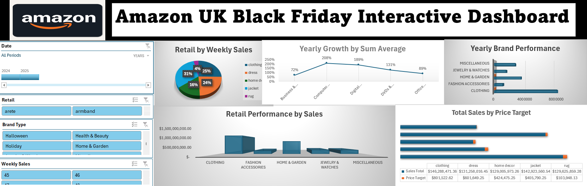
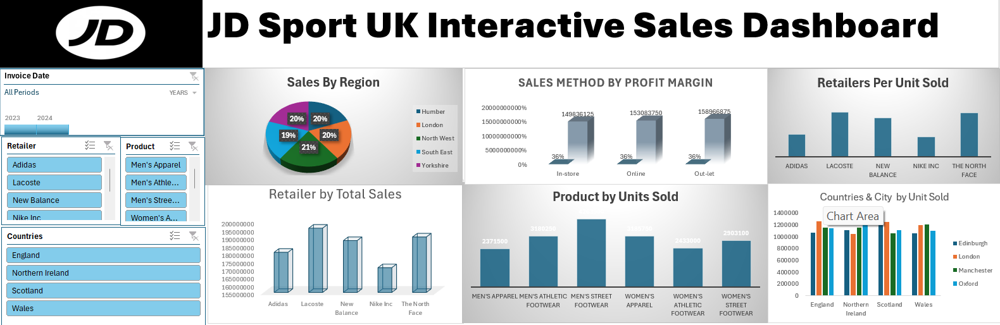

# Project 1

**Title:** [Amazon Black Friday Interactive Dashboard](https://github.com/Damilarry/SA_mytech.github.io/blob/main/Amazon%20UK%20Dashboard.xlsx)

**Tools Used:**  Chart Types & Insertion, Chart Design & Formatting, Data Analysis Tools, Advanced Visualization Tools, Interactive Features

**Project Description:** An interactive Excel dashboard analyzing Amazon UK Black Friday sales trends, customer behavior, and product performance. Features include: •	Sales Insights: Revenue trends, top-selling categories, and product performance. •	Customer Analysis: Purchase patterns, demographics, and spending behavior. •	Discount Impact: Correlation between discounts and sales volume. •	Real-Time Trends: Hourly and daily sales performance visualization. Built using Excel's advanced data analysis and visualization tools, this dashboard provides data-driven insights for optimizing Black Friday sales strategies.

**Key findings:** Based on the analysis of Amazon UK's Black Friday performance, here are the key findings:
1. Record-Breaking Sales During Black Friday Week
Amazon UK experienced its largest sales volume to date during the Black Friday Week with increase of 31% in Jacket sales, surpassing previous years' figures.

2. Year-Over-Year Growth in Online Sales
•	Overall Growth: Black Friday online sales in the UK rose by over 50% compared to the previous year, indicating a significant increase in consumer online shopping activity. 
•	Amazon's Performance: Amazon reported record sales during Black Friday Week and other retails, reflecting robust consumer engagement and successful promotional strategies.

3. Retail and Brand Performance
•Discounts and Savings: UK shoppers enjoyed average savings of 30% across Amazon UK during Black Friday, highlighting the effectiveness of promotional campaigns.

4. Total Sales Relative to Targets
Despite economic challenges, projections indicated a 34% rise in sales, reaching billion from Black Friday. However, online spending exceeded expectations compares to previous year. These insights reflect Amazon UK's strategic approach to Black Friday, focusing on substantial discounts, effective promotional campaigns, and robust online sales performance, all contributing to record-breaking sales during the period.

**Dashboard Overview:**

# Project 2

**Title:** Employee Data

**SQL Code:** [Employee Data Sql Code](https://github.com/Damilarry/SA_mytech.github.io/blob/main/EmploeeData_Project1.Sql)

**SQL Skills Used:** Data Retrieval (SELECT): Queried and extracted specific information from the database. Data Aggregation (SUM, COUNT): Calculated totals, such as sales and quantities, and counted records to analyze data trends. Data Filtering (WHERE, BETWEEN, IN, AND): Applied filters to select relevant data, including filtering by ranges and lists. Data Source Specification (FROM): Specified the tables used as data sources for retrieval.

**Project Description:** The Employee Data Management System is a SQL-based project designed to efficiently manage employee information for an organization. This project involves creating, managing, and querying a relational database that stores employee details, job positions, salaries, departments, and performance records. The goal is to enable HR and management teams to access, analyze, and update employee data easily.  Conclusion, the Employee Data Management System provides a structured approach to managing employee information with efficient querying capabilities. It supports HR functions such as salary management, performance tracking, and report generation. Future enhancements could include stored procedures, triggers, and a web-based front-end for user interaction.

**Objectives:** To design a normalized database for storing employee-related information. To perform CRUD (Create, Read, Update, Delete) operations efficiently. To generate insightful reports, such as employee salaries, department-wise counts, and performance metrics. To implement data integrity and validation using primary keys, foreign keys, and constraints.

**Technology used:** SQL server

# Project 3

**Title:** [JD Sport Interactive Sales Dashboard](https://github.com/Damilarry/SA_mytech.github.io/blob/main/JD%20Sports-Dashboard.xlsx)

**Tools Used:** Chart Types & Insertion, Chart Design & Formatting, Data Analysis Tools, Advanced Visualization Tools, Interactive Features

**Project Description:** This project entails developing an interactive Excel dashboard to analyze and visualize JD Sports' sales performance across various dimensions. The key components of the dashboard include:
1.	Sales by Region: A breakdown of sales figures across different geographical regions, highlighting top-performing areas and identifying regions with growth potential.
  
2.	Sales Method by Profit Margin: Analysis of various sales channels (e.g., online, in-store) to determine their respective profit margins, aiding in strategic decision-making regarding channel optimization.
   
3.	Retail Performance Based on Units Sold: Evaluation of retail outlets based on the number of units sold, identifying high-performing stores and those requiring attention.
   
4.	Retailer Performance by Total Sales: Assessment of each retailer's contribution to total sales, facilitating performance benchmarking and partnership evaluations.
   
5.	Top-Performing Products by Units Sold: Identification of best-selling products, enabling inventory optimization and targeted marketing strategies.
	
6.	Country & City Performance Based on Units Sold: Detailed analysis of sales performance at the country and city levels, uncovering local market trends and opportunities for expansion. This dashboard leverages Excel's data analysis and visualization capabilities to provide JD Sports with actionable insights, supporting informed decision-making and strategic planning.

**Key findings:** Based on the analysis of JD Sports' sales performance, here are the key findings across various dimensions:
1. Sales by Region
•	Northwest: Northwest emerged as JD Sports' largest revenue-generating region, accounting for 21% of total sales. This growth was bolstered by strategic acquisitions and organic expansion in the U.K. market. 
•	London: The London market experienced a 20% year-on-year revenue increase, reaching £3.09 billion in the financial year ending 2024. 
•	Southeast: Revenue in Southeast region grew by 19% year-on-year.

•	2. Sales Method by Profit Margin
•	Retail Stores: Revenue from physical retail stores increased by 36% year-on-year. 
•	Online Channel: Online sales experienced a 36% decrease, reflecting a consumer shift back to in-store shopping post-pandemic. 

3. Retail Performance Based on Units Sold
With exact figures on units sold per retail outlet are provided, the increase in retail store revenue is majorly from Lacoste and North Face suggests a positive trend in in-store sales performance.

4. Retailer Performance by Total Sales
JD Sports' total revenue reached £10.4 billion in FY2024, marking a 2.7% increase from the previous year.

5. Top-Performing Products by Units Sold
•	Footwear: This segment saw an 15% revenue growth, totalling £19.5 billion in FY2024, indicating strong consumer demand.

6. Country & City Performance Based on Units Sold
Detailed data on sales performance by England, Scotland Wale, Northern Ireland.
These insights underscore JD Sports' robust performance across various regions and product categories, with notable growth in the London market and the footwear segment.

**Dashboard Overview:**

# Project 4

**Title:** Football Players Data

**SQL Code:**[Football Players Sql Code](https://github.com/Damilarry/SA_mytech.github.io/blob/main/Football_Players_Data_Sql)

**SQL Skills Used:** Data Retrieval (SELECT): Queried and extracted specific information from the database. Data Aggregation (SUM, COUNT): Calculated totals, such as sales and quantities, and counted records to analyze data trends. Data Filtering (WHERE, BETWEEN, IN, AND, TRY_CAST, RANK): Applied filters to select relevant data, including filtering by ranges and lists. Data Source Specification (FROM): Specified the tables used as data sources for retrieval

**Project Description:** This project focuses on the analysis of a comprehensive dataset containing detailed information about approximately 11,000 football players. 
The primary objective is to utilize SQL for extracting meaningful insights regarding player demographics, performance metrics, and other relevant attributes.

1. Database Design and Implementation: Develop a relational database schema to effectively store and manage the football players' data, ensuring normalization and referential integrity.

2. Data Analysis Using SQL: Execute SQL queries to analyze various aspects of the dataset, including: Player demographics (e.g., age, nationality). Performance metrics (e.g., ratings, positions). Financial attributes (e.g., wages, market value).

3. Insight Extraction: Identify patterns and trends within the data, such as: Nationalities with the highest representation among players. Correlation between player attributes and performance metrics. Distribution of players across different clubs and leagues.

4. Reporting and Visualization: Present the findings through comprehensive reports and visualizations to facilitate better understanding and decision-making.

**Objectives:** By the end of this project, we aim to have a fully functional SQL database capable of providing in-depth analysis of football players' data, offering valuable insights for stakeholders such as team managers, scouts, and analysts.

**Technology used:** SQL server

